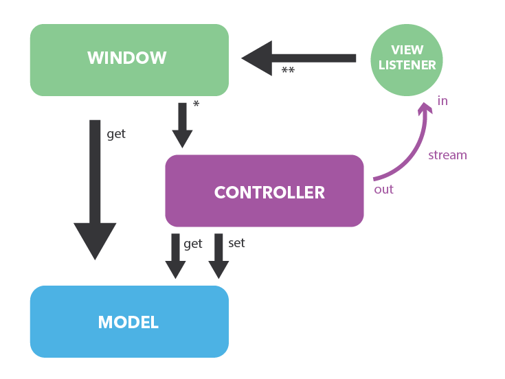

# SecureBallot

Electronic voting system based on symmetric and asymmetric encryption.

* [Getting Started](#getting-started)
  * [Enabling SSL for MySQL Server](#enabling-ssl-for-mysql-server)
  * [Creating JKS](#creating-jks)
  * [RFID Reader Setup](#rfid-reader-setup)
  * [Adopted Technologies](#adopted-technologies)
* [Project Structure](#project-structure)
* [MVC Pattern](#mvc-pattern)
  * [User to App Operations](#user-to-app-operations)
  * [App to User Operations](#app-to-User-operations)
  * [Derived Classes](#derived-classes)
* [Project Execution](#project-execution)
* [Tests](#tests)
* [Voting Process](#voting-process)
  * [Procedure Creation](#procedure-creation)
  * [Session Setup](#session-setup)
  * [User Registration](#user-registration)
  * [Preferences Expression](#preferences-expression)
  * [Vote Confirmation](#vote-confirmation)
  * [Supervisor Authentication and Results Printout](#supervisor-authentication-and-results-printout)
* [Encryption](#approfondimento-aspetti-crittografici)
* [Authors](#authors)

## Getting Started

The App can be imported as Maven project in any Java IDE. The project has been developed and tested using JDK14.

The different terminals use SSL both for terminal-to-terminal communications and terminal-to-DB communications. Because of this, to fully test the project's functionalities, a MySQL server enabling SSL and Java keystores are required.

### Enabling SSL for MySQL Server

Once MySQL server is installed, one must enable it for SSL communications, following the steps below:

1. Generate DB's certificates and keys
```bash
user@pc: sudo mysql_ssl_rsa_setup --uid mysql
```
2. Check if the following files do exist in `/var/lib/mysql/`:
    - ca.pem
    - client-key.pem, client-cert.pem
    - server-key.pem, server-cert.pem

3. Edit `/etc/mysql/mysql.conf.d/mysqld.cnf `, adding at the end:
```vim
ssl-ca = /var/lib/mysql/ca.pem
ssl-cert = /var/lib/mysql/server-cert.pem
ssl-key = /var/lib/mysql/server-key.pem
```

4. Restart MySQL server and check if SSL is now enabled:
```bash
user@pc: sudo service mysql restart
user@pc: sudo mysql -u {db_user} -p
  mysql> SHOW VARIABLES LIKE "%ssl%"; 
```

5. If everything went as planned now the two variables `have_openssl` and `have_ssl` should be set to `YES`. Retry the previous steps otherwise.

6. To test the SSL DB connection via MySQL WorkBench, edit connection and provide `ca.pem` (SSL CA), `client-key.pem` (SSL Key) and `client-cert.pem` (SSL CERT) files.


### Creating JKS

1. Create a directory and copy inside the `ca.pem`, `client-cert.pem` and `client-key.pem` files previously created.

```bash
user@pc: mkdir Desktop/db-ssl
user@pc: sudo cp /var/lib/mysql/ca.pem /home/user/Desktop/db-ssl
user@pc: sudo cp /var/lib/mysql/client-key.pem /home/user/Desktop/db-ssl
user@pc: sudo cp /var/lib/mysql/client-cert.pem /home/user/Desktop/db-ssl
user@pc: sudo chown user:user Desktop/db-ssl/*.pem
```

2. Execute the script [jks_configuration.sh](jks_configuration.sh) and follow the step-by-step procedure for TrustStores, KeyStores and config files creation, needed for the proper functioning of the project. This script needs two parameters: the path to the directory where the repo git was cloned, and the path to the directory created the previous step, containing the files for the SSL connection.
```bash
user@pc: cd Desktop/evoting
user@pc: chmod +x jks_configuration.sh
user@pc: ./jks_configuration.sh . /home/user/Desktop/ssl-db
```

3. Modules `Poll`, `ProcedureManager`, `Test` and `Urn` require the insertion of DB connection's credential. These information can be updated at a later stage, editing the rows `dbu` (username) e `dbp` (password) of the file `src/main/resources/cfg/psws.cfg`.

4. If everything went as planned now each project module should contain a `ssl` directory and a `src/main/resources/cfg` directory.

### RFID Reader Setup

The last phase of pre-configuration requires the installation of some drivers to allow the App's interaction with the RFID readers. To this end one must: 
1. Add the current user to the group owning the `/dev/tty*` files, `dialout` typically. Then logout and login to update permits

```bash
user@pc: sudo usermod -a -G dialout user
user@pc: reboot
```

2. Copy the `rfid/librxtxSerial.so` in `/usr/lib`

```bash
user@pc: sudo cp rfid/librxtxSerial.so /usr/lib
```

3. Install Maven and add the `rfid/RXTXcomm.jar` file to the local repository:
```bash
user@pc: sudo apt-get install maven
user@pc: mvn install:install-file -DgroupId=gnu.io -DartifactId=rxtx -Dversion=2.2pre2 -Dpackaging=jar -Dfile='rfid/RXTXcomm.jar' -DgeneratePom=true
```

These steps must be repeated for each computer used for the project.


### Adopted Technologies

Java, Maven, GitHub, JUnit, JavaFX, MySQL


## Project Structure

This project is composed of several Maven modules, specifically:
- Common contains base and utility classes needed by the other modules, imported at compile time.
- Post, Procedure Manager, Station, Subsidiary Station, and Urn are the single terminals used during the voting process.
- Test imports all the other modules to execute Unit and Integration tests.

Each module (with the exception of Common and Test) has the following structure:

    Module
      src/main/java
        module.app
          App.java //Main
        module.controller
          Controller.java
          //other controller's classes
        module.model
          //model's classes
        modulo.view
          View.java
          //view's classes
        modulo.view.viewmodel
          //view model's classes (how the view internally represent data)
      src/main/resources
        fxml
          //JavaFX's scenes (.fxml)


## MVC Pattern

<p align="center">
  
</p>

Modules follow the MVC design pattern

Controller and View share a common Model.
Additionally the View has access to the public methods of the Controller and expose some specific methods to be called by the Controller.

### User to App Operations

The user interact with the View wich will call one or more Controller's public methods.
Since the Controller holds the business logic these methods will potentially alter the Application's state.

For example, considering the post during the voting phase:
	
- the user clicks on a preference shown on screen ->
- the View calls the "add_a_preference" method ->
- the Controller updates the Model (Post) to add the preference (persistent information).


### App to User Operations 

The Controller may be influenced by factors external to the user. In these cases it updates the Model (if needed) and then call the exposed View's methods to send one of 3 types of message: 

- Print a dialog
- Print an error message
- Signal a state change that requires the View to read the Model

For example, considering the station after the cast of a vote:

- The vote packets are sent by a post to the Station's Controller ->
- The Controller stores these packets into the Model ->
- The Controller updates the Model to point that a post has terminated casting a vote ->
- It signals the View that the state has changed and to update itself reading the Model's data ->
- The View show a message to the user and change the state of the i-th post.


### Derived Classes 

In the Common module the classes ViewManager and AbstrController are defined.
These classes are extended in each terminal module and implement the MVC pattern.
In  fact for each app there is a class Controller extending AbstrController which contains the business logic and a class View extending ViewManager managing the GUI.
Persistent data and the state of the app are stored in a Model class named after the app itself (it is a little more than a getter/setter).

## Project Execution

Before the project can be started, the database structure must be created and the database must be populated with the data regarding the new voting procedure (active and passive electorate, electoral lists, voting stations and posts, voting session etc).

1. Execute the `sql/structure.sql` script in order to create the database structure.

2. Use Procedure Manager software in order to populate the database. This app will check the existence of a "root" user (creating it if it doesn't already exist), allow the creation of new users (technics and supervisors) and the loading of the `.csv` files needed for the procedure creation. The module can generate templates for these files. A complete set of `.csv` files can be found in `Evoting/ProcedureManager/sample_csv`.

3. Once the form for the procedure creation is filled (basic procedure informations, supervisor selected, `.csv` files loaded) the process can continue and the software will signal the success of the operation or if some errors occured.

4. Verify that the values of these members in `Evoting/Common/src/main/java/utils/Constants.java` are as follows:
```java
public class Constants {
  
  public static boolean dbSSL = true;
  public static boolean linkSSL = true;
  
  public static boolean devMode = false;
  
  public static boolean verbose = false;
  
  public static boolean postRfid = true;
  public static boolean statRfid = true;
  public static boolean auxStatRfid = true;
}
```


## Tests

In order to test the code in addiction to try to run the apps, one may use the `Test` module.

Tests are design to verify that all the functionalities offered by every module work as intended (excluding `Poll` and `ProcedureManager` for now).
Addictionaly tests inside `global` package verify the behaviour and the communication between two or more terminal at the same time and contains some stress tests.

## Voting Process

The steps needed  to vote are the following:

- Preliminary phases:
  - Procedure creation 	(once per procedure)
  - Session setup	(once per session)

- Voting phases:
  - User registration
  - Preferences expression
  - Vote confirmation
  - Tallying phase:
    - Supervisor authentication and results printout


### Procedure Creation

One Procedure is defined by its supervisor, its sessions, the candidates running, the ballots and the registered voters.
The Procedure creation is done by a technic, through logging and executing the software `ProcedureManager`.
Through this software the technic select a supervisor for the Procedure and add all the data listed above via `.csv` files.
During this phase symmetric session keys are generated, which will be used for mutual authentication between virtual ballot box and other terminals during each session.
Only the chosen supervisor will be able to start each session and, at the end of the Procedure, to start the tallying phase.
That is because vote packages are encrypted using the supervisor's public key, so they can only be decrypted with supervisor's private key.
For each supervisor there are two different pairs of asymmetric keys: the first pair is used, as already stated to encrypt and decrypt vote packages; the second one is used to sign vote packages.


### Session Setup

One Procedure contains one or more vote Sessions, time intervals during which the virtual ballot box may be started and will accept vote packages. This means that voting outside of the Session is not possible, even if the Procedure is still valid.
To start a Session the supervisor must log in in the virtual ballot box software and select the session, allowing the virtual ballot box to retrieve all needed security parameters (supervisor's public key, session keys).
Then all the terminals (posts, stations, subsidiary stations) must be activated by manually inserting the correct session key, which will be verified by the virtual ballot box.


### User Registration

The voter goes to the station and is identified by document and registered by the station's staff.
Staff also verify that the voter is entitle to vote using station software, which will contact the virtual ballot box to this end.
If the voter is actually entitled and has not voted yet then an association between the voter, a random free post and a free card will be created.
The station stores all the active associations' informations (including voter identity) but sends to the posts only the ID of the card chosen by staff.


### Preferences Expression

The voter enters into the post associated and brings the card close to the RFID reader.
The post verifies that the card is the right one and, if that's the case, proceeds with the vote. Vice versa it informs the user about the error and asks him to contact the staff.
The voter express his/her preferences using the post's software which as already stated do not knows the voter's identity. So the software will be able to read and encrypt these preferences but won't be able to know who has voted.
The software will show to the voter one screen per ballot he/she must fill in. Each screen shows the ballot's title, description, number of preferences and will lists all candidates or options for that ballot.
The voter express a preference by clicking on the name of one candidate or on one option (or leaving the ballot unfilled) and proceeding to the next ballot.
After a recap screen where the voter will be asked to confirm his choices, the software will contact the virtual ballot box asking for as many nonces as preferences the current voter can express. Once the nonces are received by the post, it solves the nonces' challenge (using its symmetric session key) and attaches the answers to the vote packet, which is then sent to the station.
The station won't be able to read the encrypted preferences, not knowing the supervisor's private key.
The software then urges the voter to return the card in order to end the voting procedure.


### Vote Confirmation

The voter returns the card and the station's staff let the station read it through the RFID reader.
The software retrieves the correct association and send the voter's data and the encrypted vote packet to the virtual ballot box.
The virtual ballot box will execute some additional controls and will respond with the outcome of the operation.
If the operation is successful the virtual ballot box will store the encrypted vote packet into the database, signing it using the second supervisor's private key.
The station read the virtual ballot box's response showing it to staff and voter.
If the operation was successful the station will remove the association and will make the post avaiable for a new voter.


### Supervisor Authentication and Results Printout

At the end of the Procedure the chosen supervisor, using the `Poll` software, log in and proceeds with the tallying phase.
The supervisor is the only one who can start this phase, since the decryption of the vote packets requires his/her private key, which can only be decrypted with the supervisor's personal password. Additionally his/her second public key is needed to verify the vote pakets' signatures.


## Encryption

Ballots' encryption starts inside the post in the following function 

    Postazione/src/main/java/postazione/controller/Controller.askForNonces

This function ask the virtual ballot box for the nonces required to encrypt the user's votes.
It retrives and puts in an vector of integer the maximum number of preferences of each ballot.
Given 3 ballots with 3, 4, and 1 maximum preferences it will return the vector {3, 4, 1}. 

Once it receives the request the virtual ballot box calls the following function:

    Urna/src/main/java/urna/controller/Controller.genNonces

    ArrayList<ArrayList<String>> genNonces(InetAddress ipPost, ArrayList<Integer> structure) throws PEException {
      String sessionKey = db.getTerminalSessionKey(urna.getProcedureCode(), urna.getSessionCode(), ipPost, "Post");
      ArrayList<ArrayList<Integer>> voteNonces = NonceManager.genMultipleNonces(structure);
      ArrayList<ArrayList<String>> encryptedNonces = NonceManager.encryptMultipleNonces(voteNonces, sessionKey);
      urna.setVoteNonces(ipPost, voteNonces);
      
      return encryptedNonces;
    }

This function

- retrieves the post's session key
- creates a vector of vectors of nonces, according to the ballots' number of preferences sent by the post
  - the structure of our example was {3, 4, 1}
  - the generated nonces will be organized as follows: {{n00, n01, n02}, {n10, n11, n12, n13}, {n20}}
- encrypts the nonces using the post's session key, mantaining their structure
- stores the nonces in a map, associating them with the post's ip
- returns the encrypted nonces so that they can be sent to the post

The post receives the encrypted nonces
{{En00, En01, En02}, {En10, En11, En12, En13}, {En20}}
and can finally proceed with preferences encryption.

In the following function

    Postazione/src/main/java/postazione/controller/Controller.sendVote

in 

    ...
    for(int i = 0; i < ballots.size(); i++) {
      WrittenBallot ballot = ballots.get(i);
      ballot.encryptBallot(pubKey, encryptedNonces.get(i), sessionKey);
      encryptedBallots.add(ballot);
    }
    ...

each ballot proceeds with vote packet creation, using the nonces' vector given to it,
calling the function

    Common/src/main/java/model/WrittenBallot.encryptBallot 

and in particular:

    ...
    int index = 0;
    for(String preference : preferencesSet) {
      VotePacket packet = VoteEncryption.encrypt(preference, Kpu_rp, encryptedNonces.get(index), sessionKey);
      index ++;
      
      encryptedVotePackets.add(packet);
    }
      
    for(int i = maxPref - preferencesSet.size(); i > 0; i--) {
      VotePacket emptyPacket = VoteEncryption.encrypt(Protocol.emptyPreference, Kpu_rp, encryptedNonces.get(index), sessionKey);
      index ++;
      
      encryptedVotePackets.add(emptyPacket);
    }
    ...
The encryption of each vote packet is done by the function:

    Common/src/main/java/encryption/VoteEncryption.encrypt:

    public static VotePacket encrypt(String vote, Key Kpu_rp, String encryptedNonce, String sessionKey) throws PEException {
        
        String Ki = RandStrGenerator.gen(15, 30);
        String iv = RandStrGenerator.gen(15, 30);
        
        String encryptedVote = AES.encryptVote(vote, Ki, iv);
        String encryptedKi = RSA_OAEP.encrypt(Ki, Kpu_rp);
        String encryptedIV = RSA_OAEP.encrypt(iv, Kpu_rp);
        
        String solvedNonce = NonceManager.solveChallenge(encryptedNonce, sessionKey, 3);
        
        VotePacket packet = new VotePacket(encryptedVote, encryptedKi, encryptedIV, solvedNonce);
        HMAC.sign(packet, sessionKey);
        return packet;

    }

The encryption of the string which identifies the candidate is AES using CBC mode,
so firstly the random string Ki (symmetric key) and iv (initial value) are created.

These are used for encrypting the preference `vote`, and encrypted themself using the supervisor's public key `Kpu_rp`.

In order to prove its identity to the virtual ballot box the post must overcome the challenge given by the nonce (the challenge regarding the votes' sending is the third one hence the "3").

It is then created the vote packet which will contains all this data, and immediatly signed using the post's symmetric session key.

The filled ballots containing the vote packets are finally sent to the virtual ballot box.

The virtual ballot box receives and analyzes the filled ballots in

    Urna/src/main/java/urna/controller/Controller.voteReceived

and in particular in:

    ...
    
    	db.verifyVoteData(procedureCode, sessionCode, voterID, encryptedBallots, ipStation.getHostAddress(), ipPost.getHostAddress());
	String sessionKey = db.getTerminalSessionKey(procedureCode, sessionCode, ipPost, Terminals.Type.Post);

	if(!verifyNonces(encryptedBallots, ipPost, sessionKey)){

		...

		return response;
	}

	if(verifyBallotsHMAC(encryptedBallots, ipPost, sessionKey)) {
		signBallots(encryptedBallots);
		db.storeVotes(procedureCode, sessionCode, voter, encryptedBallots, ipStation, ipPost);

		...

	}
	
    ...

- data about session, station, post and voter is checked (db.verifyVoteData)
- nonces are verified (verifyNonces)
- the digital signature is checked (verifyBallotsHMAC)


If all control are passed then the vote is stored in the database (db.storeVotes).

